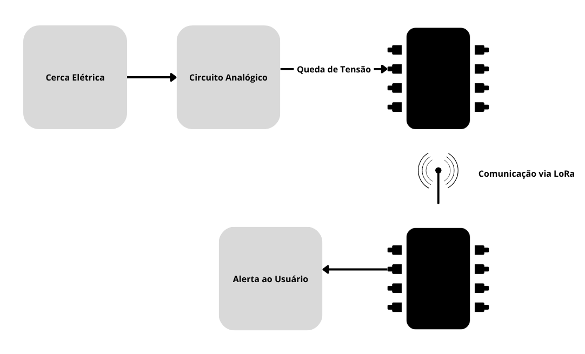
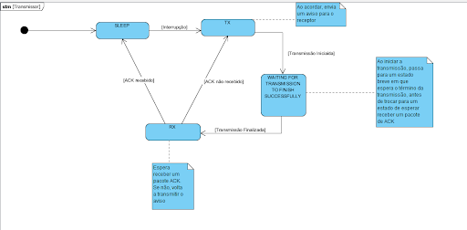
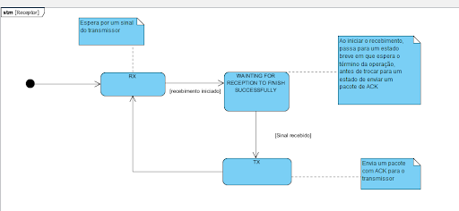
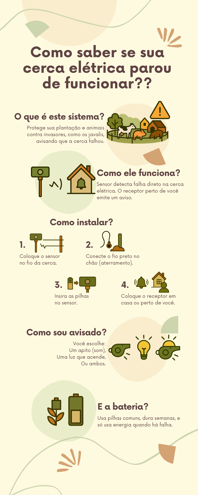

# ⚡ Comm Protocol — Sistema de Monitoramento de Cercas Elétricas com LoRa


---

## 📖 Resumo

O **Comm Protocol** é um sistema de **baixo custo e baixo consumo de energia** para detecção de falhas em cercas elétricas, desenvolvido como parte da disciplina **Projetos em Engenharia de Computação**.

O projeto visa proteger plantações e animais contra invasores, como javalis, alertando imediatamente quando há interrupção na cerca elétrica. Ele combina **hardware simples**, **firmware otimizado em C/C++** e **comunicação via LoRa** para operação em áreas rurais isoladas.

> 🎯 **Impacto Social**: Aumenta a segurança rural, reduz prejuízos e fortalece a autonomia de pequenos produtores, alinhando-se aos ODS 7, 10, 11 e 12.

---

## 📚 Contexto Acadêmico

Este projeto foi concebido e implementado como parte da disciplina **Projetos em Engenharia de Computação**, com abordagem híbrida de desenvolvimento (Waterfall + Kanban) e validação em laboratório.

O trabalho engloba:

- Desenvolvimento de **circuito analógico** para sensoriamento seguro de alta tensão.
- Desenvolvimento de **firmware embarcado** para acoplar ao sensoriamento.
- Documentação e entrega de **prototipagem funcional**.

---

## 🎯 Objetivos

- Detectar quedas abruptas de tensão na cerca elétrica.
- Enviar alertas usando comunicação **LoRa**.
- Garantir confiabilidade com **protocolo de confirmação (ACK)**.
- Operar por longos períodos com baixo consumo energético.

---

## 🛠 Tecnologias e Componentes

- **MCU**: Raspberry Pi Pico W / RP2040 com LoRa SX1262
- **Linguagem**: C/C++ (Pico SDK)
- **Comunicação**: LoRa (modulação de espectro espalhado)
- **Circuito Sensor**: Resistor de alto valor, capacitor e retificador de onda completa
- **Ferramentas**: CMake, Ninja, Trello, GitHub, Osciloscópio, Multímetro

---

## 🖧  Arquitetura do Sistema



- **Transmissor**: Conectado à cerca elétrica, detecta quedas abruptas de tensão via circuito analógico e envia alerta via LoRa.
- **Receptor**: Recebe o alerta e notifica o usuário via LED, som ou ambos.

---

## 📡 Protocolo de Comunicação com Confirmação (ACK)

O sistema implementa um **protocolo de confirmação** para garantir a entrega confiável das mensagens.

| Componente   | Função                                            |
| ------------ | --------------------------------------------------- |
| **TX** | Envia alerta e aguarda confirmação do RX.         |
| **RX** | Recebe alerta e envia confirmação de volta ao TX. |

<div style="display: flex; gap: 10px;">
  <div style="flex: 1; text-align: center; border: 1px solid #ccc; border-radius: 10px; padding: 10px;">
    <strong>Transmissor (TX)</strong><br>
    
  </div>
  <div style="flex: 1; text-align: center; border: 1px solid #ccc; border-radius: 10px; padding: 10px;">
    <strong>Receptor (RX)</strong><br>
    
  </div>
</div>

---

## 📊 Consumo de Energia

| Estado               | Corrente Média | Potência Aproximada |
| -------------------- | --------------- | -------------------- |
| Transmissão (TX)    | 114 mA          | 65 mW                |
| Processamento (Idle) | 32 mA           | 5,1 mW               |

> O sistema só consome energia relevante durante o envio de alertas, permitindo autonomia de semanas usando pilhas comuns.

---

## 📦 Estrutura do Repositório

📦 Projeto

├── 📂 comm_protocol/ → Código-fonte do transmissor e receptor (C/C++ com Pico SDK)

└── 📂 docs/ → Diagramas, imagens, documentação e manuais

---

## 🚀 Como Compilar

```bash
# Clonar o Pico SDK
git clone https://github.com/raspberrypi/pico-sdk --branch master
cd pico-sdk && git submodule update --init
export PICO_SDK_PATH=../../pico-sdk

# Compilar o projeto
mkdir build && cd build
cmake .. -G Ninja
ninja
```

---

## 📥 Upload para o RP2040

  Segure o botão BOOTSEL ao conectar o Pico.

  Copie o .uf2 gerado para a unidade montada.

---

## 🖼 Cartilha de Uso


📄 [Baixar cartilha em alta resolução](docs/images/cartilha_uso.png)

---
